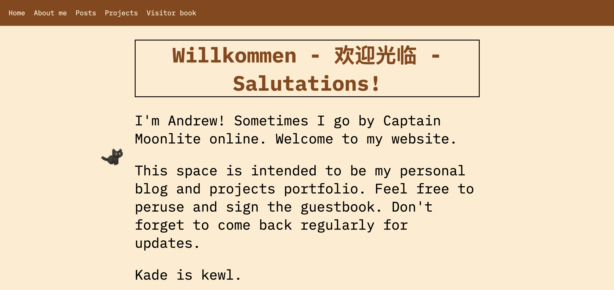
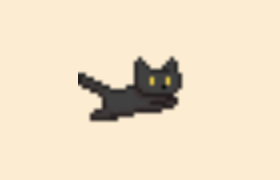

# Yuh i made a website hehe

See it here: https://andrewj-25.github.io/cml-blog/

This website is Captain Moonlite's personal blog, projects portfolio and online second home :p

This was also an excuse to learn some web dev: this project involved me reading up on html, css and js for the first time. Had plenty of fun doing this.

LinkedIn and Instagram profiles get monotonous and I wanted a personal space online I can customise. Many hackclubbers have personal sites so I decided to make my own.

No part of this website was made using AI!

## Features
### Animated cat

An animated cat tracks the cursor on the homepage. Different animations are played according to direction. Spritesheet was downloaded for free from here: https://pop-shop-packs.itch.io/cats-pixel-asset-pack

### Random pic
A random picture is selected from a folder and displayed. A button swaps the picture.

### Guestbook
A guestbook will be implemented in the future. This will involve some backend dev and security features.
